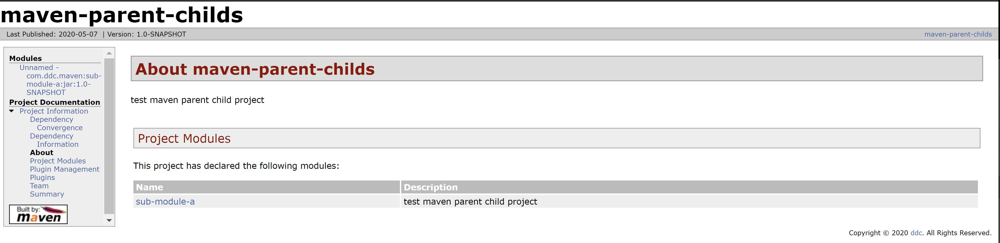

# Maven
## maven build lifecycle

### 3个内置的生命周期
- Default : 用于生成项目的artifact
- Clean : 用于清理项目
- Site : 用于生成项目的文档

#### Default生命周期的所有阶段(phase)
- validation : 验证项目是正确的，并且所有必要的信息都是可获得的 
- compile : 编译项目的源代码
- test : 使用一个合适的单元测试框架来测试编译好的源代码。这些测试应该不会要求代码被打包或者部署
- package : 将编译好的代码打包成可以发布的格式，如JAR
- integration test : 如果有必要，将发布包处理和部署到一个可以运行集成测试的环境中
- verify : 运行任何检查来证实该发布包是有效的并符合质量标准的
- install --> install -U : 将发布包安装到本地仓库中，以便用作其他本地项目中的一个依赖库
- deploy : 在一个集成或者发布环境，为了与其他的开发人员和项目进行共享，将最终版的发布包复制到远程仓库中

## maven plugin
maven的插件都是绑定到不同的阶段上运行的，常用的maven插件如下
- clean : 在构建之后清除
- compile : 编译Java源代码 
- deploy : 将构建的artifact部署到远程仓库
- install : 将构建的artifact安装到本地仓库
- resources : 将资源复制到输出目录下，以便包含在JAR中
- site : 为当前项目生成一个站点
- surefire : 在一个隔离的类加载器中运行Junit测试
- verify : 对于集成测试特别有用，验证某种条件的存在

## pom中的所有组件
- modelVersion ： 唯一支持的版本是4.0.0
- groupId : 项目的组织ID
- artifactId : 项目ID
- packaging : 项目打包的类型，支持pom、ear和war
- version : 项目当前的版本号， "-SNAPSHOT"表示还处于开发阶段没有发布
- dependencies : 列出依赖库
---

compile|provided|runtime|test|system
:------:| :------:|:-----:|:---:|:----:
compile|✔|✔|✔|✔|✔|️
provided|✔| |✔| 
runtime| |✔| |✔
test| | |✔| 
system| | | |✔
---

### Usage
#### 国内的网络下载dependencies比较慢，可以在setting.xml里面配置一个ali的mirror
```
<mirror>
    <id>alimaven</id>
    <name>aliyun maven</name>
    <url>http://maven.aliyun.com/nexus/content/groups/public/</url>
    <mirrorOf>central</mirrorOf>
</mirror>
```

#### site
```
mvn site

need to specify the version of plugin maven-project-info-reports-plugin
<plugin>
    <groupId>org.apache.maven.plugins</groupId>
    <artifactId>maven-project-info-reports-plugin</artifactId>
     <version>2.9</version>
</plugin>
```


#### clean
```
mvn clean -> maven-clean-plugin
```

#### compile
```
mvn compile -> maven-compiler-plugin
<plugin>
    <!-- groupId can be skipped because this plugin is maven core plugin -->
    <artifactId>maven-compiler-plugin</artifactId>
    <configuration>
        <source>1.8</source>
        <target>1.8</target>
    </configuration>
</plugin>
```
#### test
```
mvn test -> maven-surefire-plugin
<plugin>
    <!-- groupId can be skipped because this plugin is maven core plugin -->
    <artifactId>maven-surefire-plugin</artifactId>
    <configuration>
        <!-- <includes>**/Test*.java</includes> -->
    </configuration>
</plugin>
```

#### surefire-report
```
mvn surefire-report:report -> maven-surefire-report-plugin
<plugin>
    <!-- groupId can be skipped because this plugin is maven core plugin -->
    <artifactId>maven-surefire-report-plugin</artifactId>
</plugin>
```
#### install本地jar到本地maven仓库
```
mvn install:install-file -Dfile=lib/UCXJPS84.jar -DgroupId=uc4 -DartifactId=UCXJPS84 -Dversion=1.0 -Dpackaging=jar
```
#### -U参数
强制更新SNAPSHOT

#### help
```
maven-help-plugin
查看当前激活的profile --> mvn help:active-profiles
列出当前所有的profile --> mvn help:all-profiles
```
#### 清理安装到本地仓库and跳过测试
```
mvn clean install -DskipTests
```
#### 查看项目架包依赖
```
mvn dependency:tree
```
#### Maven 插件开发
```
-DarchetypeCatalog=internal解决一直卡在从远程服务器获取catalog的问题
mvn archetype:generate  -DarchetypeCatalog=internal
选择maven-archetype-plugin(An archetype which contains a sample Maven plugin.)
```
#### 生成code coverage report
```
mvn cobertura:cobertura
```

#### Maven 生成webapp
```
mvn archetype:generate -DarchetypeGroupId=org.apache.maven.archetypes -DarchetypeArtifactId=maven-archetype-webapp -DarchetypeVersion=1.4
```

#### parent-child project
- maven-parent-childs/pom.xml
```
<?xml version="1.0" encoding="UTF-8"?>
<project xmlns="http://maven.apache.org/POM/4.0.0"
         xmlns:xsi="http://www.w3.org/2001/XMLSchema-instance"
         xsi:schemaLocation="http://maven.apache.org/POM/4.0.0 http://maven.apache.org/xsd/maven-4.0.0.xsd">
    <modelVersion>4.0.0</modelVersion>

    <groupId>com.ddc.maven</groupId>
    <artifactId>maven-parent-childs</artifactId>
    <version>1.0-SNAPSHOT</version>
    <!-- the packaging should be set as pom if current project is parent project -->
    <packaging>pom</packaging>

    <!-- define sub-modules -->
    <modules>
        <module>sub-module-a</module>
    </modules>

    <developers>
        <developer>
            <name>Ding Dechao</name>
            <id>ddc</id>
            <organization></organization>
            <roles>
                <role>Java Developer</role>
            </roles>
        </developer>
    </developers>

    <description>test maven parent child project</description>
    <organization>
        <name>ddc</name>
        <url>ddc</url>
    </organization>
    <inceptionYear>2020</inceptionYear>

    <build>
        <pluginManagement>
            <plugins>
                <plugin>
                    <artifactId>maven-compiler-plugin</artifactId>
                    <configuration>
                        <source>1.8</source>
                        <target>1.8</target>
                    </configuration>
                </plugin>
                <plugin>
                    <artifactId>maven-surefire-plugin</artifactId>
                    <configuration>
                        <!-- <includes>**/Test*.java</includes> -->
                    </configuration>
                </plugin>
                <plugin>
                    <artifactId>maven-surefire-report-plugin</artifactId>
                </plugin>
                <plugin>
                    <groupId>org.apache.maven.plugins</groupId>
                    <artifactId>maven-project-info-reports-plugin</artifactId>
                    <version>2.9</version>
                </plugin>
            </plugins>
        </pluginManagement>
    </build>
</project>
```
- maven-parent-childs/sub-module-a/pom.xml
```
<?xml version="1.0" encoding="UTF-8"?>
<project xmlns="http://maven.apache.org/POM/4.0.0"
         xmlns:xsi="http://www.w3.org/2001/XMLSchema-instance"
         xsi:schemaLocation="http://maven.apache.org/POM/4.0.0 http://maven.apache.org/xsd/maven-4.0.0.xsd">
    <parent>
        <artifactId>maven-parent-childs</artifactId>
        <groupId>com.ddc.maven</groupId>
        <version>1.0-SNAPSHOT</version>
    </parent>
    <modelVersion>4.0.0</modelVersion>

    <artifactId>sub-module-a</artifactId>
</project>
```
#### 一个pom能够从它的父pom继承的所有元素
- 依赖库
- 开发者和贡献者
- 插件列表
- 报告列表
- ID匹配的插件执行
- 插件配置
---

## Abbreviation
- POM : Project Object Model

